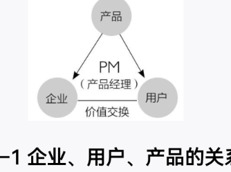
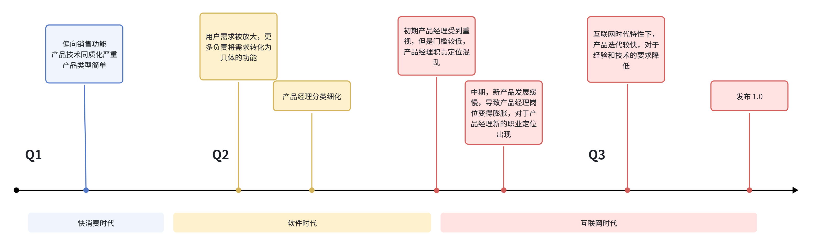
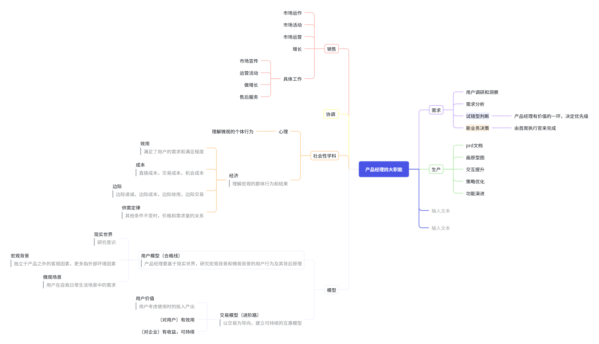
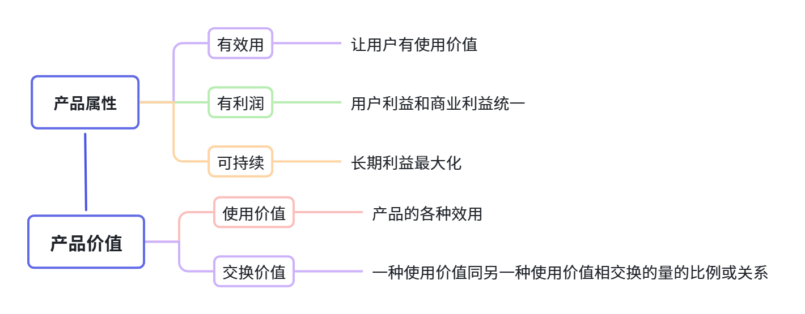
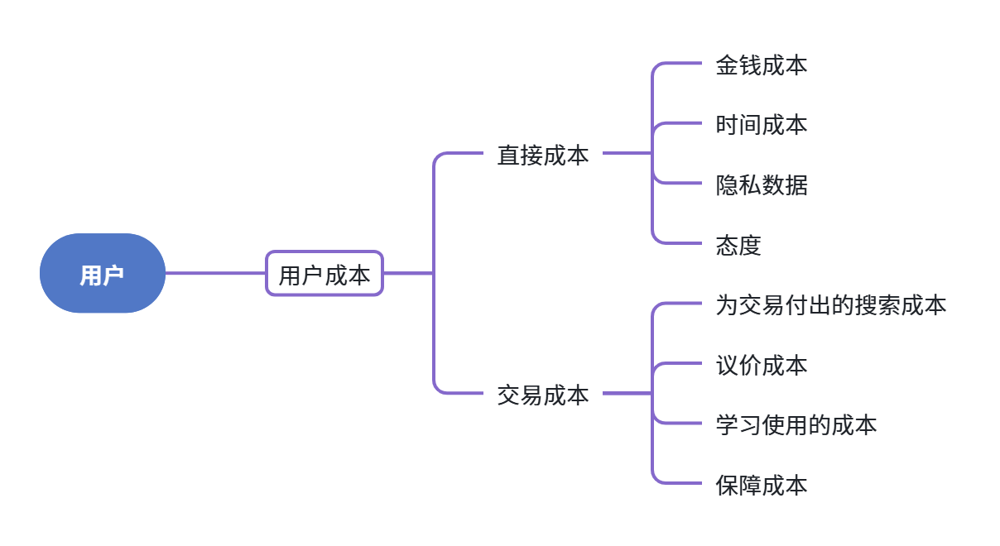
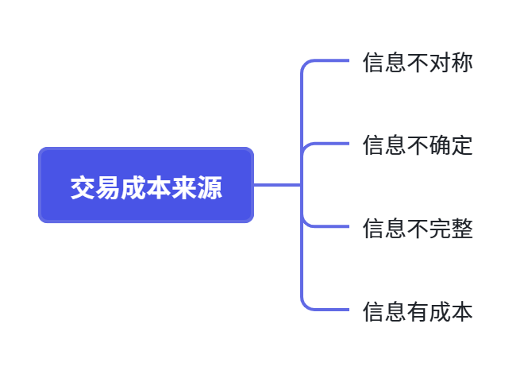
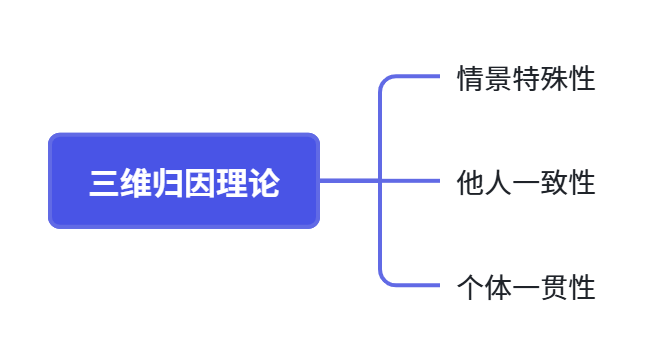
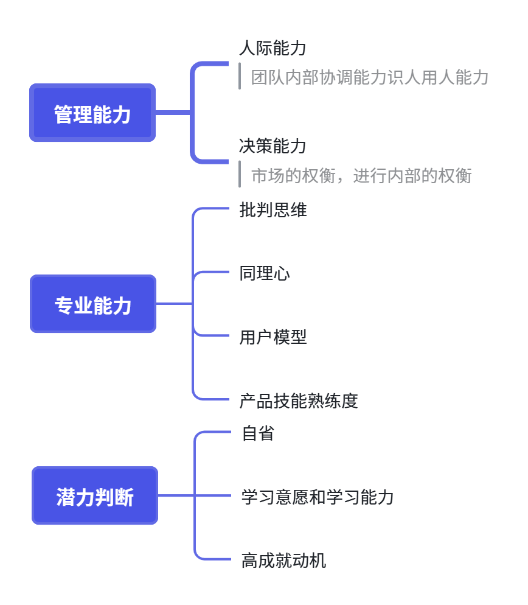
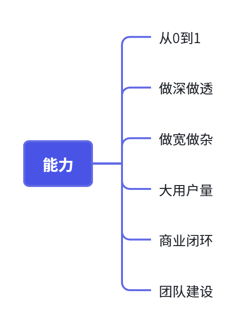
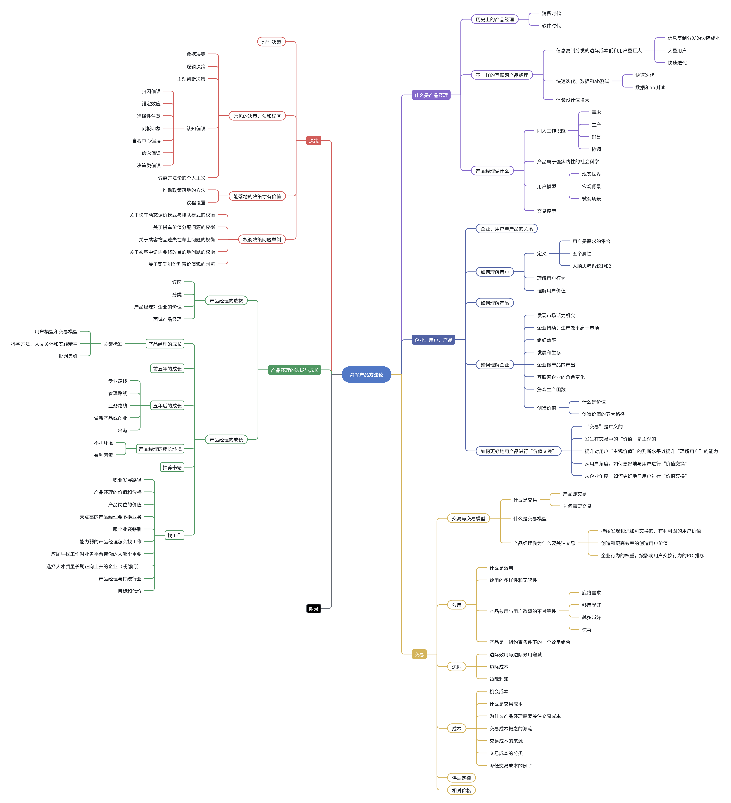

# 《俞军产品方法论》读书笔记

## Idea记录

### 第一章

1. 香皂的产品质量无法拉开差距，香皂生产的技术也不会有显著性差异，想要和其他产品产生明显区别，主要靠市场驱动，但更主要的是做定位、做营销、做渠道。
   Idea：初期的产品经理受快消费时代影响，产品的技术和质量同质化 较高，产品类型也更加初级，所以产品主要依赖于市场驱动。
2. 以产品经理作为驱动力的产品与销售管理体系逐步建立，并开始允许公司内部品牌旗下的产品在市场上相互竞争。
   Idea：快消费时代产品的提升更多依靠市场上的竞争，由市场来推动 产品的完善。伴随着产品的完善，产品的生命周期拉长，产品经理的 责任制度逐渐形成
3. 软件时代的产品经理偏重于进行项目管理和推进，按照客户的要求准时上线产品。
   Idea：进入软件时代，客户的需求被放大，但对于产品后期的要求没有被重视,对产品的设计要求也相对较低。更多的是保证产品可以正常的使用，不会经常出现漏洞。
4. 用户更容易搜寻、度量、比较不同产品，使得市场竞争更激烈，出现马太效应
   Idea：互联网时代的发展让产品在大量用户间传播的更快，用户的需 求和体验感更加被放大，产品间两极分化严重。Q:底层产品在这样的生态下如何竞争成功？
5. 产品要经过需求，生产，销售三个环节。产品经理要对产品的市场结果负责，需要对这三个环节分别进行关注，并“协调”公司不同分工下的不同职能。
   Idea：产品经理需要先分析用户需求来定义产品，规划产品架构。有了大致的框架和清晰的方向后，设计出满足需求的产品，这样才有市场，有用户。最后，将产品销售出去，完成和用户的交易。
6. 每一个影响时代的新要素出现后，跟我们的生活和生产方式结合，就能创造无数的新产品，我们可以根据需求去判断可以做什么。
   Idea：新要素出现，人们对于新要素的使用会有新的需求，针对需求分析新时代下产品经理可以做什么，对于那些需求进行深挖。
7. 在互联网时代，产品经理的“销售”和“协调”工作做得平庸一点，不是严重问题。而对“需求”理解的好坏，往往能够决定一个产品的生死。
   Idea：互联网时代分工更加细化，销售由专门的人员更多负责。互联网产品只要让用户用上就是完成了销售。所以钻研需求，让用户用上产品反而更加重要
8. 我们依然要研究总结很多经验和规律，便于预测用户行为、市场变化，也便于指导未来的决策，这样能提高企业效率。但我们要明白，人有异质性，社会有情境性，这些与产品相关的经验和规律只是具有统计意义上的显著性，只可归纳，不可演绎。
   Idea：产品工作偏向社会学科，不具有重复性，很多总结的规律和经验应用时需要结合具体问题分析
9. 用户模型视为产品经理的合格线，掌握的标志是：预判产品迭代后的用户行为变化，准确率较高。
   Idea：用户模型的掌握为什么以对后续迭代行为变化判断是否正确为标志，而不是以对用户需求是否解读到位为标准
10. 产品经理不但要研究行为，更多的是要研究行为背后的意识，从而预判不同的产品对用户未来行为产生的影响。
    Idea：产品经理更多要研究现实世界的意识，意识背后是用户，所以本质更多关注用户
11. 微观场景是直接影响用户当前意识的环境。
    Idea：微观场景更多聚焦于用户在当下场景的需求有什么，比起宏观场景微观关注于用户在日常生活中小的生活场景
12. 交易模型要求产品经理除了掌握用户模型，还能理解一个领域各利益方的价值判断和行为习惯，以及产品实现过程中的各种干扰因素。
    Idea：交易模型需要以交易为导向，建立可持续交易。因此要求分析用户利益和各种干扰因素来保证交易的互惠和可持续性
13. 因为用户关心的是得到什么和付出什么，包括这个产品给他什么效用组合，需要他付出多少金钱或时间等。用户同样也会比较机会成本，看这个产品是比其他产品更好用还是更让他离不开，从用户角度来看，这就是一个交易过程。
    Idea：用户更在意的是自己使用产品的投入产出比，用户在使用产品的时候也是在进行情绪价值的交易，思考如何创造更多的用户价值是产品经常强调的。
14. 一个好产品要有三个属性：（对用户）有效用，（企业）有收益，可持续。
    Idea：产品经理分析时要兼顾用户需求与企业利益，不能完全被用户需求所牵制，同时也要思考对企业的收益与是否可持续

### 第二章

1. 企业以产品为媒介，与用户进行价值交换，达成创造商业价值的目的。
   
   Idea：企业通过创造用户价值来吸引用户使用产品增加持续收益，获得商业价值。
2. 企业在给定条件下，选择满足哪些用户需求，创造哪些用户价值，以更多地促成交换，让企业有最高的边际收益和ROI（投资回报率）。
   Idea：产品经理需要判断哪些需求是可以去满足的
3. 我们知道影响用户行为的有偏好、认知、情境（包含五步）
   Idea：偏好和认知会驱动用户自发地产生行为，如果这方面做的较少，需要情境来辅助刺激用户产生行为
4. 因为用户不一样，所以我们说的理解用户，是要从具体的个人去积累一个一个案例。
   Idea：这里是将个体用户的数据汇总来总结规律，而不是把规律嵌套进用户之中
5. 人主观感知的效用越大（欲望满足程度越高），幸福度越高
   Idea:前文提到欲望驱动行为的原因
6. 有些宗教教义或心灵鸡汤就是通过降低个人欲望的方式让人提升幸福感。
   Idea：在消费主义和电商发达的时期降低欲望会比较困难
7. 人做决策的约束条件是价值最大化，
   Idea：做决策的时候人会自然的选择价值最大化的选项，价值最大化和相对价格有关，相对价格影响着资源配置，市场运作，高层决策等
8. 用户价值 =新体验–旧体验– 替换成本
   Idea：用户价值是用户在思考体验的成本并比较后得到的。但是具体到产品感觉体验很难量化。
9. 产品是一种价值交换的媒介，企业用产品与用户交换价值。
   Idea：公司利用产品输出价值 公司将产品价值提供给用户，用户将用户价值反馈给用户。用户价值的反馈有助于产品的迭代
10. 分析产品的重点是弄明白这个产品利从何来、利往何去，它创造了什么价值，价值是怎么分配的。
    Idea：产品与价值密不可分，分析产品的重点是搞清楚产品服务于谁，这些人群可以带给产品什么利益，这个利益又会分配给谁，他在用户那里创造的价值有什么，对这些价值的细分并分析等等
11. 以创造用户价值为目的，打破一个旧的利益平衡，建立一个对己方有利的新产业链，这样的产品才容易成功。
    Idea：产品的目的是创造更多的用户价值，最终目的的打造对自己有利的产品，并形成产业链创造长期收益。
12. 洞察：这其实是利用信息不对称获利。
    Idea：利用信息差发现风口，从而改变约束条件，利用新的方式来实现利益最大化
13. 产品经理这个职业能为企业创造最大价值之处，就是在于“发现市场获利机会”，但不幸的是，这里往往存在类似阿罗信息悖论
    Idea：产品经理通过分析市场挖掘需求来洞察市场获利的机会，但是发现机会距离成功落地有很长的距离，且成功的影响因素很多，不能完全说成功来源于发现
14. 企业的边界只能扩大到因企业内部科层增加而增大的组织成本等于外部市场交易成本之时
    Idea：企业内部科层的增加会增加内部的管理成本，外部市场交易成本包括原料成本，发现市场价格的成本、谈判和达成契约的成本、交易过程不确定性的风险成本等。例如当企业开通新业务时管理成本必然增加，企业发现向外寻找供应链厂商、谈判成本等等高于企业自身搭建供应链的成本，那么企业会选择扩张来满足业务需求
15. 尤其是一些大型互联网企业对人类生活的影响太大了，其影响和控制的深度、广度使它们早已不适合继续用传统企业的经济人定位。
    Idea：互联网企业对人们影响过于大，比起追求经济效益，企业更应该承载社会发展，通过产品引导人们走向和谐美好社会
16. 这些信息不是know-how，或者最多是know-how的一部分，只有团队成员亲自一路摸爬滚打所验证和积累的知识和理解才是有效的know-how，才能为企业在该领域的未来竞争和决策提供有力帮助。
    Idea：相比于经济效益，后三项更是决定企业是否良性生存下来的关 键
17. Q=Fr（L，K，M，C：T）
    Idea：Q：企业产量  
    r：外部规则（外部的法律政策社会地理等外部因素的改变）
    T：技术（第二重要的因素）
    L：劳动力
    K：资本 M：原材料
    C：给定外部条件下的内部游戏规则（长期竞争力的核心因素，企业内部应该优化的部分）
18. 所以“产品即交易”里的“交易”，是指把人的任何有意识行为，看作付出预期代价购买预期收益
    Idea：预期代价: 指在做出某项决策或进行某项投资时，预期需要支付的货币、时间、体力等代价。这些代价是决策过程中必须考虑的因素。
    预期收益: 指在做出某项决策或进行某项投资后，预期能够获得的回报。这些收益可能包括金钱、时间节省、精神满足等。

### 第三章

1. 在没有强迫或欺诈的前提下，拥有自由选择权的理性人，只有在预期收益大于直接代价，且预期收益大于机会成本的情况下，才会做出交易行为
   Idea：
   预期收益大于直接代价：理性人在考虑是否进行某项交易时，首先会评估预期的收益是否大于所需的直接付出代价。如果预期收益不足以覆盖直接代价，那么理性人通常不会进行该交易。
   预期收益大于机会成本：机会成本是指为了得到某种收益而放弃的其他潜在收益。理性人在进行交易时，不仅要看总收益，还要比较这些收益与因选择该交易而放弃的其他机会的潜在收益。只有当预期收益大于这些机会成本时，交易才会被理性人视为有价值的。
2. 这就是这个世界无时无刻不在发生交易的原因——交易创造价值。
   Idea：交易不仅是价格上的等价交换，更主要的是用户在经过主观和理性分析之后做出的行为，这个行为背后为双方增加了新的价值，相比如市场上的价格价值，其背后的新增加的价值更会驱动用户交易
3. 交易模型在某种意义上也是商业模式，是多边关系平衡的利益创造和利益分配模式。
   Idea：利益创造：如何创造收益（利从何来）利益分配：如何分配利益（利从何去）
4. 企业行为的权重，按影响用户交换行为的ROI排序
   Idea：ROI（投资回报率）强调企业在进行各种行为时，应优先考虑那些能够带来最高投资回报的行为。
   不同行业对ROI的影响因素各不相同：
   电商和外卖行业：价格通常比使用体验更影响用户行为，因为用户可以轻松比较不同平台的价格。
   视频和内容类产品：供给比使用体验更影响用户行为，因为内容的丰富度和可获得性是用户选择的关键。
   搜索引擎和工具类产品：使用体验和先发优势的影响权重较高，因为用户对产品的依赖度较高。
5. 而如果配送速度这个高优先级需求得不到满足，其他效用在这个情境下都无从谈起。
   Idea：或许应该思考一下怎么丰富产品功能来满足客户个性化及时性的需求来留住用户
6. 理论上可以一直做到边际收入等于边际成本的均衡点，
   Idea：
   边际收入：指增加一个单位产量所带来的总收入的增加量。
   边际成本：指增加一个单位产量所带来的总成本的增加量。
   在经济学中，厂商利润最大化的条件是边际收入等于边际成本。当收入大于成本时，增加产量可以增加总利润（因为边际收入是按单位产量计算的）；当收入小于成本时，减少产量可以增加总利润。只有在MR等于MC时，厂商的利润达到最大。
7. 其生产的时候一开始有规模效应，边际成本是逐步降低的。但到了某一个临界点后，其边际成本反而有可能会变高。
   Idea：
   规模效应: 当生产规模扩大时，由于固定成本被更多的产品分摊，单位产品的成本下降，这就是规模效应。例如，生产更多的汽车可以降低每辆车的制造成本。
   边际成本：在一定产量水平下，增加一个单位产量所引起的总成本的变动数。它通常只考虑变动成本，因为固定成本在短期内是不变的。
   边际成本递减: 在生产初期，由于规模效应，边际成本往往呈现递减趋势。这是因为固定成本在总成本中的占比逐渐减少，而变动成本增加的比例较小。
   边际成本递增: 但是，当产量达到一定程度后，继续扩大生产可能会导致边际成本上升。这可能是由于资源限制（如原材料短缺）、管理复杂性增加（如协调更多工人和设备）、过度使用设备导致维护成本上升等因素。
8. 对交易成本的理解和分辨有助于产品经理更清晰地思考“成本”和“交易模型”。
   Idea：理解交易成本有助于产品经理在分析时准确划分什么是成本，交易背后的隐性成本有什么，是什么样的成本阻碍了用户交易产品
9. 移动互联网带来的交易量包括两个部分，一部分是替代效应，即对原有实体交易的替代。
   Idea：
   替代效应：互联网时代电商对原有实体产品的替代，交易费用降低，更低的费用让用户愿意支付。
   新增效应：降低了交易费用使原来交易费用较高的交易得以实现。是市场新增了产业，社会资源的配置发生了变化。
10. 网红带货降低了什么交易成本？
    Idea：
    搜寻和度量成本：用户基本依靠网红直播推荐来购买产品
    寻价成本：网红在带货前与供货商进行了砍价议价
    决策成本：依靠主播气氛烘托（321上链接）和用户对主播的信任，决策变得简化
11. 供需定律是描述市场供需和价格变化的基本规律，当需求大于供给时，价格上升，当需求小于供给时，价格下降。
    Idea：这个定律在实际应用中要注意是在其他条件不变的前提下，价格和需求的关系才成立，因为在现实时候中，价格并不是影响用户需求的唯一因素。
12. 相对价格 =（直接成本+交易成本）÷ 效用组合
    Idea：直接成本或交易成本降低，相对价格也降低。需求量增大

### 第四章

1. 旧体验最小化，本质上是选择旧体验最差的被替代品的用户
   Idea：
   旧体验: 是指用户在使用现有产品或服务过程中积累的经验，这些体验可能包括操作不便、界面不友好、功能不齐全等。
   最小化: 在不影响现有用户的基础上，尽可能减少其负面影响。
2. 如果潜在需求量较大，且看到有一种新要素（不论是降了某种成本还是提高了某种效用）
   Idea：潜在需求量增加会导致市场需求增加，经济增长；新要素的出现会降低交易成本，提高用户效用。两者都会导致市场增长，企业先抢占先机，可以扩大自己的优势。
3. 宏观经济学中有个重要概念叫卢卡斯批判。
   Idea：卢卡斯批判也是在说分析时没有充分考虑人的主观性对分析结构造成影响
   卢卡斯批判：传统政策分析往往没有充分考虑到政策变动对人们预期的影响。根据理性预期理论，人们在形成预期时会同时考虑历史信息和当前事件，并根据这些信息调整自己的行为。因此，当政策发生变化时，预期也会相应改变，进而影响人们的行为决策。
   预期调整：卢卡斯认为，由于人们会根据当前的政策变动调整他们的预期，经济主体会根据新的预期改变自己的行为，使得经济模型难以准确预测和评价政策效果。
   参数变化：政策变动引起的预期变化会导致经济模型中的参数发生变化，而这些参数的变化往往是难以量化的，这使得用计量经济学模型评估政策效果变得复杂。
4. 主观判断决策是最难的决策，没有数据或逻辑支撑，只能用关键变量和用户模型、交易模型来模拟市场运行，并据此做出判断。
   Idea：成本上，数据判断＜逻辑判断＜主观判断，越难的决策它所获得的有效数据和信息越少，越需要依靠决策者的经验知识储备和决策力
5. 大脑自有一些处理资讯的规则，为了增进决策与判断效率的“心理捷径”称作捷思，捷思有时会产生一些不好的效应，这些不好的效应称作认知偏误。
   Idea：认知偏误是由于大脑为加快决策的速度和效率而选择走捷径后，所造成的负面影响
6. 相当于以强推动能力交换降低的决策能力，这时的边际收益可能更大。
   Idea：在某些特定情况下，通过增强推动力和执行力，即使决策能力下降，仍然可以获得边际收益和回报
7. 媒体议程在某些方面影响公众观念或者与之发生相互作用，即公众议程。
   Idea：媒体对议题的呈现和建构会有倾向性，这种倾向性会影响公众的态度
8. 产品设计本质上就是利益分配的过程。
   Idea：根据滴滴各个权衡的例子可以看出产品经理在遇到问题时，最困难的一点如何权衡各方利益，模拟在情境下用户的心情，问题和痛点有什么。

### 第五章

1. 制度一旦开始演化就有自我强化和收益递增的特点
   Idea：收益递增的原因
   初始成本与运行成本: 制度在创建初期往往需要投入大量的初始成本，例如制定规则、建立机构等。一旦制度建立起来，其运行成本通常会显著降低。意味着随着时间的推移，制度的实施单位成本会下降，从而带来整体效益的增加。
   学习效应: 组织和个人在适应制度的过程中会获得经验，这种学习效应会增强他们对制度的理解和利用能力，进而提高制度的效益。
   稳定预期: 制度为各方提供了稳定的预期，增强了人们对制度持续存在的信心。这种信心使得制度更有可能被长期坚持，从而形成收益递增。
   自我强化的原因
   路径依赖: 制度演化过程中，由于存在收益递增和网络外部性，制度一旦走上某条路径，其既定方向会在以后的发展中得到自我强化。改变路径的成本和难度会随着时间的推移而增加，导致制度趋于稳定。
   惯性: 制度演化中的惯性来自于过去的选择和积累的经验。这些惯性使得制度在面对变革时具有抵抗性，从而进一步强化了现有制度的稳定性。
   锁定效应: 当某一制度安排被系统采纳后，其自我强化机制会导致其他潜在制度安排的排除，形成路径依赖的锁定效应，使得制度难以被改变或创新。
2. 按天赋高低分类——ABC分类
   Idea：产品经理按天赋高低分类：
   a:有深度思考能力或超常同理心
   善于思考事物背后的本质和互相的因果关系，善于洞察人心思考行为背后人们更主观的心理。
   b:逻辑清晰且有产品心
   不是因为外在因素，而是单纯喜欢产品经理的工作，并且逻辑清晰。
   c:不适合从事产品经理职业
   缺乏思考和职业热爱，同理心弱，自我认知较弱的人不适合做产品经理
   A类人很少见，C类人很少被招进公司，B类人在公司占比更多，在工作中B类人也会被训练出A类的产出
3. 复杂的历史进程中，通过理性推理得出正确的个人选择，在特殊条件下是可能的。
   Idea：
   特殊条件：
   这件事适合理性决策
   确信自己掌握了所有关键变量
4. 产品经理的价值=经验等级×平台匹配度×智慧等级
   Idea：
   经验等级是产品经理在入行后工作实践中学到的知识，五年左右产品经理间的经验差距减小，对于产品生产迭代企业内部等掌握程度相同
   平台匹配度是产品经理能力与平台深度绑定。产品经理一换岗位，平台匹配度会降低。不同种类的平台生态不同，产品经理在决策的时候面对的环境不同，更换平台会影响决策。
   智慧等级是做同一件事，有更强的洞察力和分析能力。
5. 产品经理的成长，可以用两个重要标准来判断，分别是用户模型和交易模型
   Idea：
   用户模型要掌握大量用户样本，分析用户，经过大量的亲身体验，模拟，反馈等预判用户的行为。只有通过在实践中反复经历磨炼才会形成。
   交易模型要以交易成功为导向研究产品，对交易成本有丰富理解，对多边利益的权衡和博弈演化有理解。
6. 一个产品经理的成长情况，也可以根据他这三方面能力的习得情况来判断。
   Idea：三个方面：科学方法、人文精神和实践精神
   科学方法：逻辑概率、控制实验、理性决策、经济学等。运用数学工具理性分析，减少认知偏误
   人文关怀：用户样本量，同理心，心理学，进化论，博弈论等。分析和研究用户的心理，模拟不同情境下的用户，权衡多边利益。
   实践精神：事实、数据、观察、实践、权衡、反馈、迭代、自省。
7. 产品岗位价值 = 有价值（事）×成功率（团队）× 成功后回报大小Idea：
   有价值：产品对用户有效益
   成功率：团队的产品心，人才质量
8. 带你的人＞业务＞平台
   Idea：平台带给自己的只是标签，而业务可以提高一个人的专业能力，对于新人找到一个好的老师学习知识可以快速提高专业知识

### 附录

1. 真正的产品经理是三位一体的
   Idea：
   三位：
   主人翁意识：把产品当成自己的子女
   决策权
   专业产品能力
   一体：好的团队环境，有产品心的团队
2. 到产品成熟期之后再参与，能够学到的就少很多了
   Idea：产品从0到1的过程才是新手产品经理能学习更多的时候，在这个过程中可以进行无数次的权衡取舍和细节决策
3. 再往上的第二至第五级的关键词分别是创造、权衡、变迁、方法论
   Idea：需要产品经理跳出，纵观全局分析
   创造：找到问题的最优解的过程，需要产品经理洞察周围，分析用户的变化趋势。
   权衡：跳出单个需求，平衡多方利益，进行取舍。
   变迁：跳出当下，对世事变迁敏感，预判用户需求并不断反思。
   方法论：要有方法论输出，追求影响力和确定性。
4. 有时候逻辑有小逻辑和大逻辑之分
   Idea：小逻辑是指站在当下自身的角度去分析问题，大逻辑是指站在全局长远的角度去分析问题。

### 附录2

#### 定义框架总结

1. 着重介绍不同时代下产品经理的责任。随着时代发展，产品类型逐渐变得复杂，市场对于产品的质量与技术要求提高
   
2. 产品经理四大工作职能
   关注需求，生产和销售，并协调公司不同分工下的不同职能。作为社会学科的学习内容
   
3. 产品的属性
   
4. 用户的属性
   
5. 成本
   
6. 交易成本来源：
   
7. 三维归因偏误：
   
8. 产品经理的能力
   
9. 产品新人的能力

   

#### 大框架

